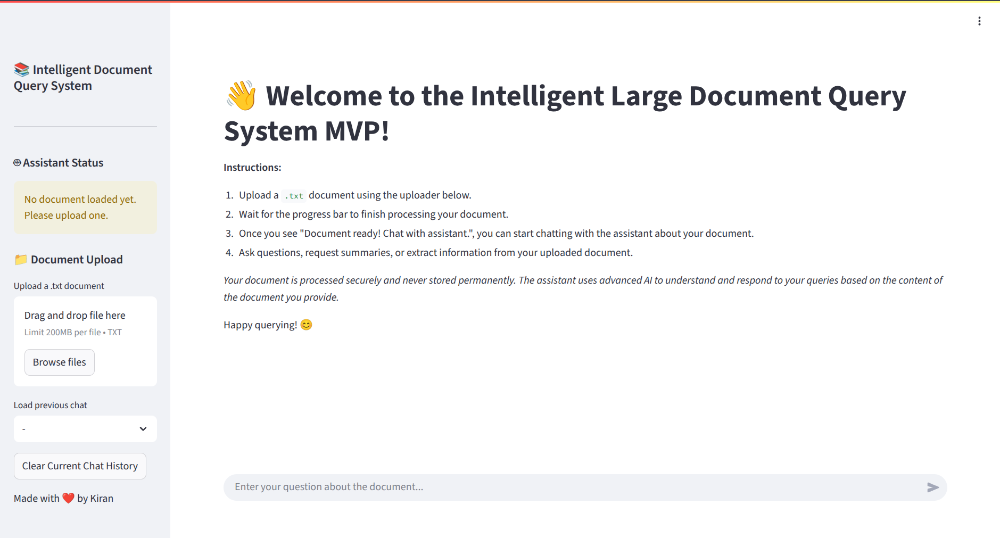
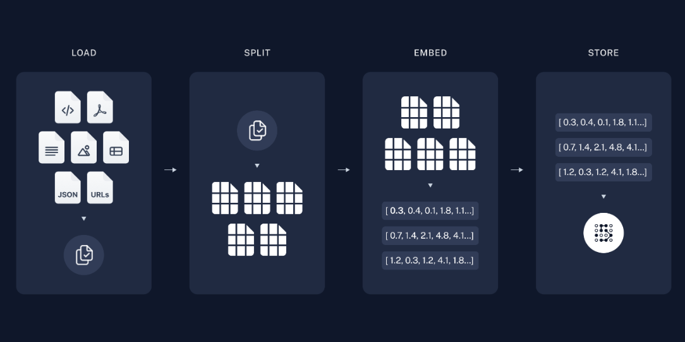
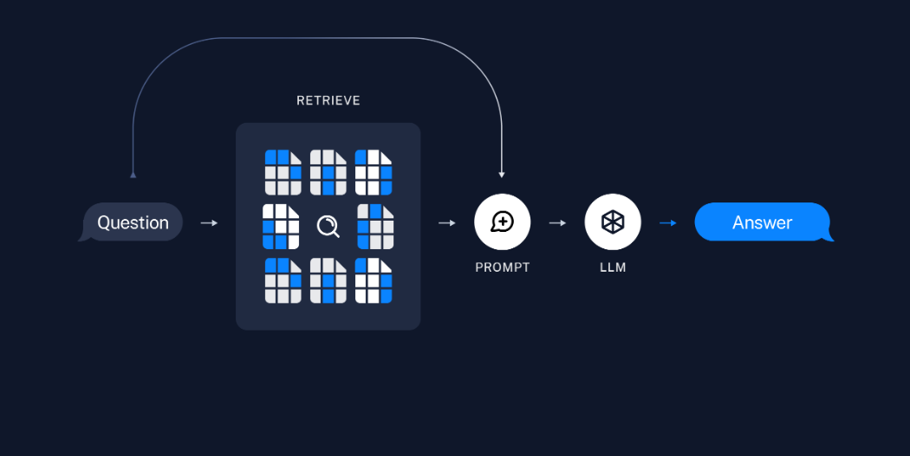

# LARGE TEXT FILE RETRIEVAL RAG MVP



## 🚀 Project Overview

Welcome to the **Intelligent Document Query System**!  
This project lets you chat with large text documents using Retrieval Augmented Generation (RAG). Upload a `.txt` file, ask questions, and get answers grounded in your document's content—no more hallucinations, just real context.

---

## 🤖 What is RAG? (Retrieval Augmented Generation)

RAG supercharges Large Language Models (LLMs) by giving them access to external, relevant information, making responses more accurate and factual.

### How RAG Works:

1. **Document Ingestion**
   - **Load:** Read your `.txt` file.
   - **Split:** Break it into manageable chunks.
   - **Embed:** Convert each chunk into a vector (embedding).
   - **Store:** Save embeddings in a vector database (ChromaDB).

   

2. **Question Answering**
   - **Embed Query:** Your question is embedded.
   - **Retrieve:** Find the most relevant chunks from ChromaDB.
   - **Augment Prompt:** Combine retrieved context, your question, and chat history.
   - **LLM Response:** The LLM answers using only the provided context.

   

---

## Project Structure

```
LLM_LargeDocumentInteraction/
│
├── app.py                # Streamlit app (main UI and logic)
├── rag_system.py         # RAG backend: chunking, embedding, retrieval
├── requirements.txt      # Python dependencies
├── docker-compose.yml    # Docker config for ChromaDB and app.py
├── docker-file           # Dockerfile for app.py
├── .env                  # Environment variables (API keys, config)
├── README.md             # This file!
│
├── chroma_db/            # ChromaDB vector database for persistent storage
│   └── chroma.sqlite3
│
├── data/                 # Storage directory for Uploaded documents
│
├── chats/                # Saved chat histories in JSON format, per document.
│
├── screenshots/          # App and RAG process images
│   ├── RAG_steps.png
│   └── RAG_process.png
│
└── .venv/                # Python virtual environment (not tracked)
```

---

## Features

- **Chat with any large `.txt` document**
- **Fast, chunked document processing with progress bar**
- **Persistent chat history (save/load/delete)**
- **Runs locally or on a VPS**
- **ChromaDB for vector search (runs in Docker)**

---

## HOW TO SET-UP

### 1. **Clone the repo and install dependencies**
```bash
git clone https://github.com/yourusername/LLM_LargeDocumentInteraction.git
cd LLM_LargeDocumentInteraction
python3 -m venv .venv
source .venv/bin/activate
pip install -r requirements.txt
```

### 2. **Set up your `.env` file**
```env
GROQ_API_KEY=your-groq-key
GROQ_MODEL=llama-3.1-8b-instant
MISTRALAI_API_KEY=your-mistral-key
# ...other keys as needed
```

### 3. **Start ChromaDB (in Docker)**
```bash
docker run -p 8000:8000 -v ./chroma_db:/chroma/chroma chromadb/chroma:latest
```

### 4. **Run the app**
```bash
streamlit run app.py --server.port 8501 --server.address 0.0.0.0
```
Visit [http://localhost:8501](http://localhost:8501) (or on your own VPS IP/domain).

---

## HOW TO USE MY MVP

- **Upload a `.txt` file** in the main area.
- **Watch the progress bar** as your document is processed.
- **Chat with your document**—ask questions, get summaries, extract info.
- **Save your chat** (with document association) using the sidebar.
- **Load or delete previous chats** anytime.
- **Switch documents**—the assistant always uses the correct context.

---

## DeploymentS

- **VPS:**  
  - Run the app as above.
  - Use Nginx as a reverse proxy for your domain.
- **ChromaDB:**  
  - Runs in Docker for easy persistence and isolation.
- **Environment:**  
  - All secrets and API keys are managed via `.env`.
  - There is an `.env.example` to guide you how to set your own keys

---

## 🙏 Credits

- Built by Kiran
- Referenced from Langchain, Chroma and Streamlit Documentations


